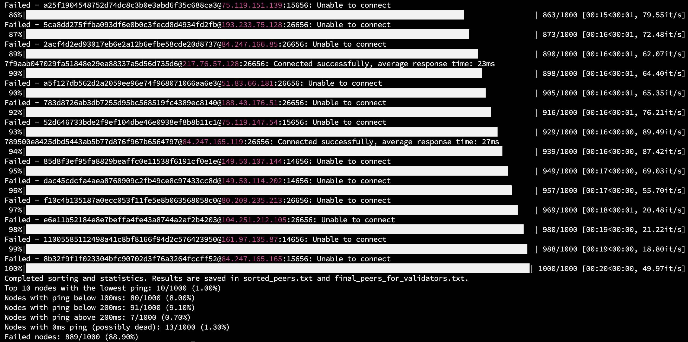
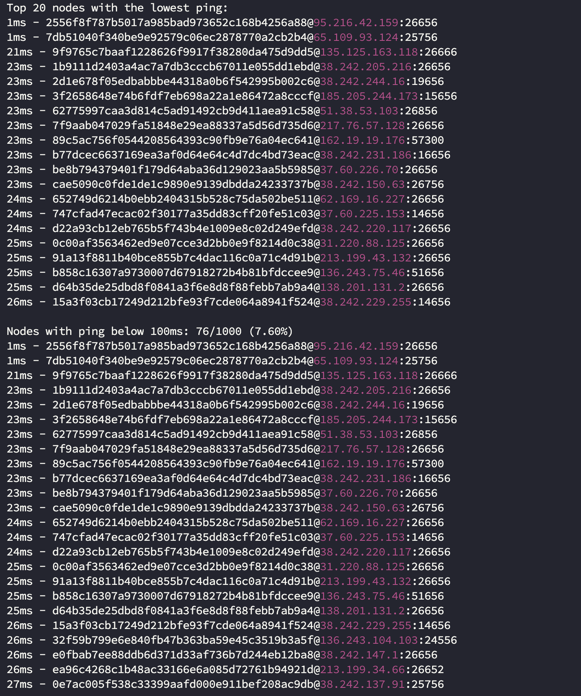

# Node Ping Script (For Validator)


The Node Ping Script is designed to help you measure the connectivity and latency between your validator node and a list of peers. By running this script, you can determine the peers with the best connection metrics, ensuring optimal performance for your blockchain network.


## Execution Environment

To ensure the best connection metrics, it is recommended to run the script on the current validator server rather than on a local machine. The ideal execution environment is a Linux operating system.

## Getting Started

### Installing Python3 and Required Packages
The script uses standard Python libraries such as socket, time, concurrent.futures, and subprocess. These libraries are included with Python’s standard library, so you do not need to install them separately.


1. **Install Python3 & required packages**:
   If you don't have Python3 on your server, you can install it using the following commands:
   
   ```sh
   sudo apt update
   sudo apt install python3 python3-pip
   pip3 install tqdm

2. **Clone the GitHub repository**:
    ```sh
    git clone https://github.com/OriginStake/node_ping.git
    cd node_ping

3. **Running the Script**
To run the script, use the following command in the terminal:
    ```
    python3 ping_node.py
    ```

The script will ping the peers, log the results, and create the necessary log files. The final results will be saved in **final_peers_for_validators.txt.**

**Notes**
  
•  Ensure that the peers.txt file contains the list of peers to ping, with each peer separated by a comma.
•  If you change the names of the log files or other configuration parameters, update the script accordingly.

We hope this guide helps you use the script effectively and achieve the desired results. We are continuously working on improving the script and will soon add a feature to check the providers of each node (e.g., Hetzner, Contabo, AWS). Stay tuned for updates!  

------------

### Configuration Parameters

The script has several configuration parameters that you can adjust as needed:

# Configuration parameters

```sh
PEERS_FILE = "peers.txt"  # File containing the list of peers to ping
TOP_N_PEERS = 50  # Number of peers with the lowest ping to log
SUCCESSFUL_PEERS_LOG_FILE = "successful_peers_log.txt"  # File to log successfully pinged peers
FULL_PEERS_LOG_FILE = "full_peers_log.txt"  # File to log detailed results of all ping attempts
SORTED_PEERS_FILE = "sorted_peers.txt"  # File to log sorted peers based on ping response time
FINAL_PEERS_FILE = "final_peers_for_validators.txt"  # File to log the top N peers with the lowest ping, Use this result to replace the persistent_peers section in config.toml


NUM_PINGS = 3  # Number of ping attempts for each peer
MAX_WORKERS = 50  # Maximum number of concurrent threads for pinging
LOG_INTERVAL = 10  # Interval for printing log messages during pinging
```

 - **PEERS_FILE**: Name of the file containing the list of peers to ping.
 - **TOP_N_PEERS**: Number of peers with the lowest ping to log. If you set this to 50, the final result file will contain the 50 peers with the lowest ping.
 - **SUCCESSFUL_PEERS_LOG_FILE**: Name of the log file for successfully pinged peers.
 - **FULL_PEERS_LOG_FILE**: Name of the log file for detailedn results of all ping attempts.
 - **SORTED_PEERS_FILE**: Name of the log file  for sorted peers based on ping response time.
 - **FINAL_PEERS_FILE**: Name of the final log file containing the top N peers with the lowest ping. This file can be used to replace the persistent_peers section in config.toml.
 - **LOG_INTERVAL**: Interval for printing log messages during pinging.
 - **NUM_PINGS**: Number of ping attempts for each peer. 
 - **MAX_WORKERS**: Maximum number of concurrent threads for pinging.

**Log Files**

 - **successful_peers_log.txt**: Stores the peers that were    successfully pinged.    
 - **full_peers_log.txt**: Stores detailedresults of all ping attempts, including failed attempts.
 - **sorted_peers.txt**: Stores peers sorted by their ping response    times.
 - **final_peers_for_validators.txt**: Stores the final list of peers with the lowest ping, formatted and ready to be copied into config.toml.

**Final Result File**



The **final_peers_for_validators.txt** file is formatted and ready to be copied into the persistent_peers section in your config.toml file. This file contains the peers with the lowest ping according to the number specified in TOP_N_PEERS.

Example content of final_peers_for_validators.txt:

    <node1_id>@<node1_ip>:<node1_port>,<node2_id>@<node2_ip>:<node2_port>,...

You can copy this content and paste it into the persistent_peers section in your config.toml.
